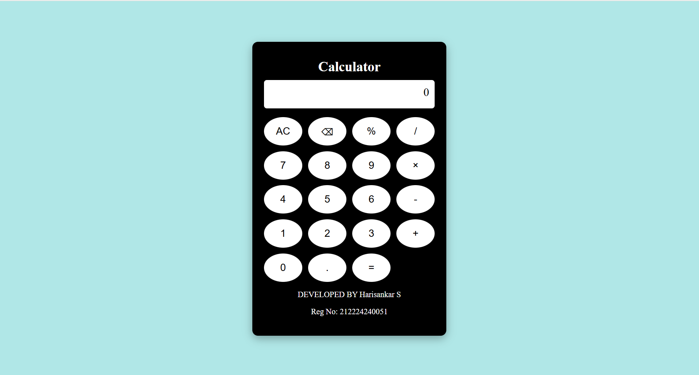

# Ex04 Simple Calculator - React Project
## Date:08-10-2025

## AIM
To  develop a Simple Calculator using React.js with clean and responsive design, ensuring a smooth user experience across different screen sizes.

## ALGORITHM
### STEP 1
Create a React App.

### STEP 2
Open a terminal and run:
  <ul><li>npx create-react-app simple-calculator</li>
  <li>cd simple-calculator</li>
  <li>npm start</li></ul>

### STEP 3
Inside the src/ folder, create a new file Calculator.js and define the basic structure.

### STEP 4
Plan the UI: Display screen, number buttons (0-9), operators (+, -, *, /), clear (C), and equal (=).

### STEP 5
Create a new file Calculator.css in src/ and add the styling.

### STEP 6
Open src/App.js and modify it.

### STEP 7
Start the development server.
  npm start

### STEP 8
Open http://localhost:3000/ in the browser.

### STEP 9
Test the calculator by entering numbers and operations.

### STEP 10
Fix styling issues and refine content placement.

### STEP 11
Deploy the website.

### STEP 12
Upload to GitHub Pages for free hosting.

## PROGRAM
HTML:
```
import React, { useState } from "react";
import "./App.css";

const Calculator = () => {
  const [input, setInput] = useState("");

  const handleClick = (value) => {
    if (value === "AC") {
      setInput("");
    } else if (value === "=") {
      try {
        setInput(eval(input).toString());
      } catch {
        setInput("Error");
      }
    } else if (value === "⌫") {
      setInput(input.slice(0, -1)); // backspace
    } else {
      setInput(input + value);
    }
  };

  return (
    <div className="calculator">
      <h1 className="title">Calculator</h1>
      <div className="display">{input || "0"}</div>
      <div className="buttons">
        <button className="btn-ac" onClick={() => handleClick("AC")}>AC</button>
        <button className="btn-special" onClick={() => handleClick("⌫")}>⌫</button>
        <button className="btn-operator" onClick={() => handleClick("%")}>%</button>
        <button className="btn-operator" onClick={() => handleClick("/")}>/</button>

        <button className="btn-number" onClick={() => handleClick("7")}>7</button>
        <button className="btn-number" onClick={() => handleClick("8")}>8</button>
        <button className="btn-number" onClick={() => handleClick("9")}>9</button>
        <button className="btn-operator" onClick={() => handleClick("*")}>×</button>

        <button className="btn-number" onClick={() => handleClick("4")}>4</button>
        <button className="btn-number" onClick={() => handleClick("5")}>5</button>
        <button className="btn-number" onClick={() => handleClick("6")}>6</button>
        <button className="btn-operator" onClick={() => handleClick("-")}>-</button>

        <button className="btn-number" onClick={() => handleClick("1")}>1</button>
        <button className="btn-number" onClick={() => handleClick("2")}>2</button>
        <button className="btn-number" onClick={() => handleClick("3")}>3</button>
        <button className="btn-operator" onClick={() => handleClick("+")}>+</button>

        <button className="btn-number zero" onClick={() => handleClick("0")}>0</button>
        <button className="btn-number" onClick={() => handleClick(".")}>.</button>
        <button className="btn-equal" onClick={() => handleClick("=")}>=</button>
      </div>

      <footer>
        <p>DEVELOPED BY Harisankar S </p>
        <p>Reg No: 212224240051</p>
      </footer>
    </div>
  );
};

export default Calculator;
```
Css:
```
body {
  display: flex;
  justify-content: center;
  align-items: center;
  height: 100vh;
  background-color: #b0e7e7;
  margin: 0;
}

.calculator {
  background-color:black;
  padding: 20px;
  border-radius: 10px;
  box-shadow: 0px 5px 15px rgba(0, 0, 0, 0.3);
  text-align: center;
  width: 300px;
}

h1 {
  margin: 10px 0;
  font-size: 24px;
  font-weight: bold;
  color: white;
}

.display {
  background-color:white;
  color:black;
  width: 100%;
  height: 50px;
  text-align: right;
  font-size: 20px;
  border-radius: 5px;
  padding: 10px;
  box-sizing: border-box;
  margin-bottom: 15px;
}

.buttons {
  display: grid;
  grid-template-columns: repeat(4, 1fr);
  gap: 10px;
}

button {
  width: 100%;
  height: 50px;
  font-size: 18px;
  border: none;
  border-radius: 50%;
  background-color: white;
  box-shadow: 2px 2px 5px rgba(0, 0, 0, 0.2);
  cursor: pointer;
}

button:active {
  transform: scale(0.95);
}

footer {
  margin-top: 15px;
  font-size: 14px;
  color:white;
}
```
main:
```
import { StrictMode } from 'react'
import { createRoot } from 'react-dom/client'
import './App.css'
import App from './App.jsx'

createRoot(document.getElementById('root')).render(
  <StrictMode>
    <App />
  </StrictMode>,
)
```
## OUTPUT


## RESULT
The program for developing a simple calculator in React.js is executed successfully.
